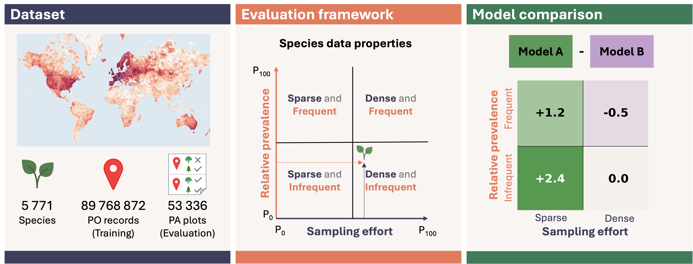
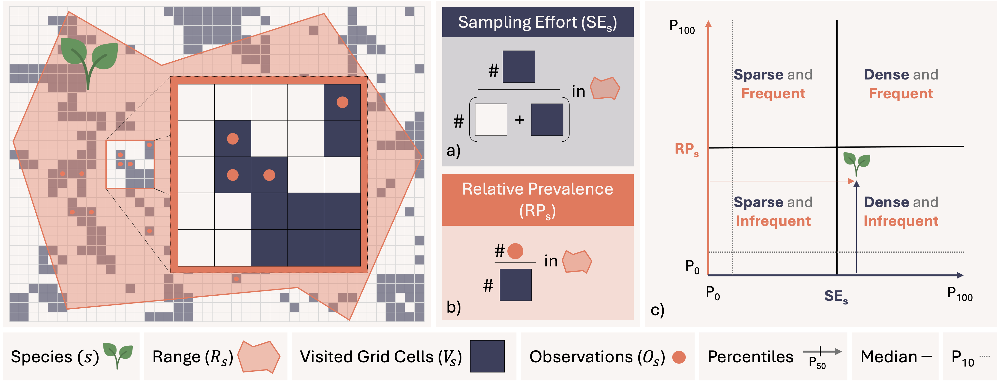
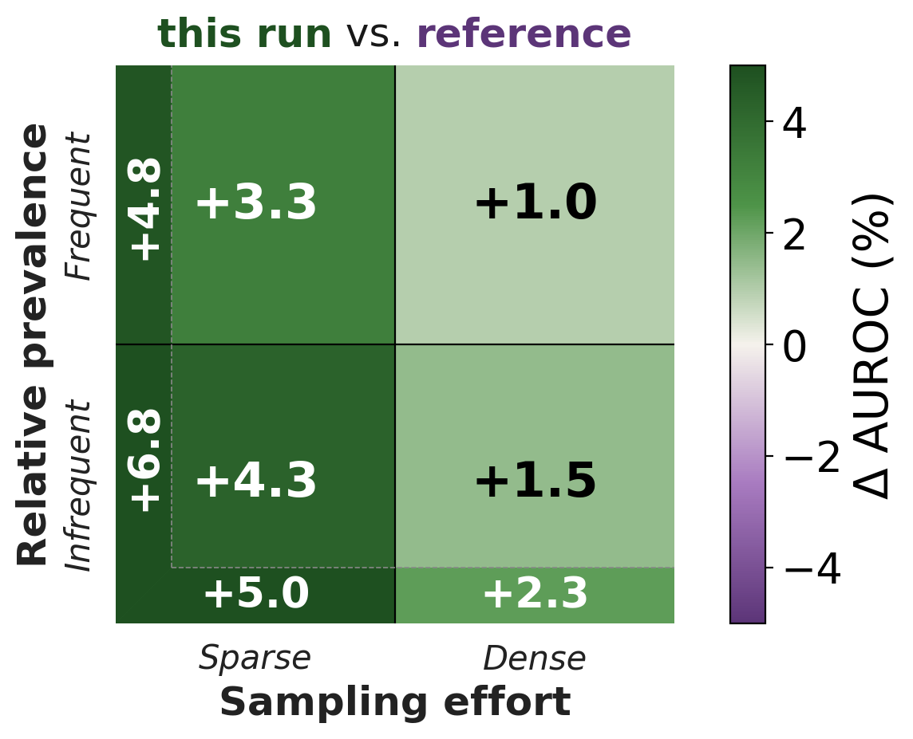

<div align="center">

# SAGE: A Sampling-Aware Global Evaluation Benchmark for Species Distribution Modeling

[](https://arxiv.org/abs/2609.31082)
[](https://earens.github.io/sage/)
[](https://pytorch.org/get-started/locally/)
[](https://lightning.ai/docs/pytorch/stable/)
[](https://wandb.ai/)
[](./LICENSE)

A global benchmark and sampling-aware evaluation framework for single- and multi-species Species Distribution Models (SDMs).

</div>

**Contents:** [Overview](#overview) · [Evaluation framework](#the-evaluation-framework) · [Installation](#installation) · [Get the data](#data) · [Reproduce our results](#reproduce-our-results) · [Use SAGE for your own model](#use-sage-for-your-own-model) · [Training and configuration](#training-and-configuration) · [Tutorials](#tutorials) · [Documentation](#more-documentation)

## Overview

SAGE is a benchmark and toolkit for training, evaluating, and comparing species distribution models (SDMs) at a global scale. Its aim is to relate model performance to each species' sampling pattern and thereby reporting performance for groups of species with similar data properties instead of a single average that hides where models fail, especially for the rare, under-recorded species that matter most for conservation.



This repository provides the three contributions of the work:

**Dataset** — a ready-made global plant benchmark: 89.8 M GBIF presence-only occurrences paired with 53,336 sPlotOpen presence-absence plots over 5,771 species, each with 52 environmental predictors. → [Data](#data) · (more details in [`docs/DATA.md`](docs/DATA.md))

**Evaluation framework** — evaluate any SDM (AUROC / AUPRG), then break the results down by **sampling effort × relative prevalence**: stratified tables and delta heatmaps that show where a model wins or loses. → [Evaluation framework](#the-evaluation-framework)

**Model comparison** — train and compare single- and multi-species SDMs, with tools for evaluation and prediction-map generation. → [`docs/MODELS.md`](docs/MODELS.md)

## The evaluation framework

Averaging performance across species hides which species a model actually serves. SAGE characterizes every species by two properties — **sampling effort** (how densely its range is sampled) and **relative prevalence** (how often it is recorded where sampling occurs) — and partitions this two-dimensional space into quadrants (sparse vs dense × infrequent vs frequent), plus extreme deciles.

<div align="center">

</div>

Performance is reported **per group** rather than as a single average. Comparing two models yields a stratified **delta heatmap** across the property space, which surfaces exactly where one model helps and where it does not:

<div align="center">

</div>

## Installation

SAGE needs **Python 3.10+** (3.12 recommended, matching the paper) and installs with **pip**. Create the environment from an explicit 3.12 interpreter. If you don't have one, install it with [`uv`](https://docs.astral.sh/uv/) (`uv python install 3.12`), Homebrew (`brew install python@3.12`), or [`pyenv`](https://github.com/pyenv/pyenv).

```bash
git clone https://github.com/earens/sage-sdm-benchmark.git
cd sage-sdm-benchmark

python3.12 -m venv --prompt sage .venv && source .venv/bin/activate
python -m pip install -U pip wheel
```

**1. Install PyTorch** *(optional)* — do this only if you need a specific CUDA build (for GPU training) or a particular CPU/MPS wheel; otherwise `pip install -e .` in step 2 pulls a working wheel on its own. The selector at https://pytorch.org/get-started/ gives the exact command for your OS and CUDA version. Pick ONE:

```bash
# Linux/Windows with an NVIDIA GPU — choose the cuXXX matching the CUDA your driver supports
#   (check with `nvidia-smi`, top-right); the pytorch.org selector shows the current build:
python -m pip install --index-url https://download.pytorch.org/whl/cu128 torch

# macOS, or Windows without a GPU:
# python -m pip install torch

# Linux without a GPU:
# python -m pip install --index-url https://download.pytorch.org/whl/cpu torch
```

For the exact torch the paper used (2.11.0 / CUDA 12.8), install from `requirements-lock.txt` instead (see the reproduction note below).

**2. Install SAGE.** Unless you know you want a minimal install, take the first line — it covers everything in this README including the [tutorials](#tutorials):

```bash
python -m pip install -e ".[tutorials]"    # recommended: core + prediction maps + notebook kernel
```

The smaller groups, if you want to keep the install lean (they compose, e.g. `".[baselines,maps]"`):

```bash
python -m pip install -e .                 # core only: train / evaluate a DeepSDM, score predictions
python -m pip install -e ".[maps]"         # + continental prediction maps (geopandas / rasterio / plotly)
python -m pip install -e ".[tutorials]"    # + maps, and the Jupyter kernel the notebooks need
python -m pip install -e ".[baselines]"    # + traditional models (Random Forest / GLM / GAM / BRT)
python -m pip install -e ".[dataprep]"     # + rebuild the processed data from raw GBIF
python -m pip install -e ".[all]"          # everything (Python side; R is separate)
```


> **Reproducing the paper exactly?** The experiments ran on Linux, Python 3.12.3, CUDA 12.8, PyTorch 2.11.0 + Lightning 2.6.5, NumPy 2.5, scikit-learn 1.9, on an NVIDIA H100. The MaxEnt baseline additionally used R 4.5.3 with maxnet 0.1.4 / glmnet 5.0. [`requirements-lock.txt`](requirements-lock.txt) pins that full stack (`pip install -r requirements-lock.txt --extra-index-url https://download.pytorch.org/whl/cu128`). GPU training is nondeterministic, so a reseeded rerun will not match bit-for-bit — the released `test_predictions.h5` are the reference for the reported numbers.

**MaxEnt and the R baselines** additionally need R. R is not a pip package, but it must be on the same `PATH` as your Python — the scripts call `Rscript` directly. Set it up either way:

- **System R** (pairs well with a venv): install R (`brew install r`, `apt install r-base`, or the CRAN installer), then `Rscript install.R` for the CRAN packages.
- **conda**: add R to the same env as SAGE so Python and `Rscript` share a `PATH`: `conda env update -n sage -f environment-r.yml`.

The data-prep taxonomy step further needs two Kew GitHub-only packages: `Rscript -e 'remotes::install_github(c("matildabrown/rWCVP","barnabywalker/kewr"))'`.

Then point the framework at your data by editing `configs/local_default.yaml`:

```yaml
data_dir: /path/to/your/data/
log_dir: /path/to/your/logs/
```

## Data

The processed data (targets, predictors, and range masks as HDF5) is hosted on **Zenodo (DOI: [10.5281/zenodo.21297133](https://doi.org/10.5281/zenodo.21297133))** as a tar archive. Download it, extract it, and point `data_dir` at the extracted folder:

```bash
mkdir -p /path/to/data && cd /path/to/data
wget -c https://zenodo.org/records/21297133/files/sage_benchmark_data.tar?download=1 -O sage_benchmark_data.tar
tar xf sage_benchmark_data.tar        # core: targets/ predictors/ range_masks_1km/ range_masks/ maps/
```

```bash
wget -c https://zenodo.org/records/21297133/files/native_ranges.tar.gz?download=1 -O native_ranges.tar.gz
wget -c https://zenodo.org/records/21297133/files/sage_po_records_nonaggregated.tar?download=1 -O sage_po_records_nonaggregated.tar
```

`sage_benchmark_data.tar` is all you need to train and evaluate. The exploration and map-generation tutorials additionally use the per-species range polygons — extract those into the same `data_dir`:

```bash
tar xzf native_ranges.tar          # -> native_ranges/
```

Then set `data_dir` in `configs/local_default.yaml` to that directory (the one now containing `targets/`, `predictors/`, `range_masks_1km/`, …).

It pairs **89.8 M GBIF presence-only occurrences** (training) with **53,336 sPlotOpen presence-absence vegetation plots** (evaluation) across **5,771 species**, each with **52 environmental predictors** (CHELSA, SoilGrids, EarthEnv topography, Human Footprint) on a 1 km equal-area grid (EPSG:6933).

→ Full layout, predictor tables, raw sources and an optional rebuild-from-raw pipeline: [`docs/DATA.md`](docs/DATA.md).

## Reproduce our results

Every reported model is trained with 5 seeds and released as a run folder `<model>_s<seed>/` in a **separate Zenodo model record** (DOI: [10.5281/zenodo.21335338](https://doi.org/10.5281/zenodo.21335338), 48 GB). All 50 runs come with `test_predictions.h5` (predicted scores) and `metrics_by_species.h5` (per-species metrics); for the 25 DeepSDM runs we additionally provide `checkpoints/best.ckpt` and `config.yaml`.

Extract into your `log_dir` — the tarballs already contain the `<run>/` folders. Ending a `tar x` command with a run-folder name extracts only that folder, so one run costs a few hundred MB rather than the full 48 GB:

```bash
LOG_DIR=$(python -c "import yaml;print(yaml.safe_load(open('configs/local_default.yaml'))['log_dir'])")


for f in checkpoints.tar configs.tar predictions.tar metrics.tar eval_test_targets.h5; do
    wget -c "https://zenodo.org/records/21335338/files/$f?download=1" -O "$f"
done

tar xf checkpoints.tar -C "$LOG_DIR" optimized_deepsdm_s2   
tar xf configs.tar     -C "$LOG_DIR" optimized_deepsdm_s2   
tar xf predictions.tar -C "$LOG_DIR" optimized_deepsdm_s2   
tar xf metrics.tar     -C "$LOG_DIR"                        
cp eval_test_targets.h5 "$LOG_DIR"/                         
```

[`configs/paper_runs.yaml`](configs/paper_runs.yaml) maps each paper model to its five run folders, and [`docs/MODELS.md`](docs/MODELS.md#the-released-runs-model-record) documents the record in full.

### Retrain a model

The DeepSDMs form an ablation ladder (Baseline → +Aggregation → +Subsampling → +Architecture → Optimized). Each experiment has its own config:

```bash
python src/main.py --exp <name> fit
# <name> ∈ baseline_deepsdm, aggregation, subsampling, architecture, optimized_deepsdm
```

All runs except `baseline_deepsdm` train on the 1 km data in `sage_benchmark_data.tar`. `baseline_deepsdm` trains on the non-aggregated records — for it, also extract `sage_po_records_nonaggregated.tar` into the same `data_dir` (it merges alongside the 1 km files; see [Data](#data)).

The MaxEnt and Random Forest single-species baselines train and evaluate through their own scripts — see [`docs/MODELS.md`](docs/MODELS.md#single-species-baselines) for the full train → select → evaluate → aggregate protocol.

### Regenerate figures and tables 

With the released predictions downloaded, reproduce the paper's numbers without retraining — for example, the Optimized DeepSDM against the Baseline:

```bash
python scripts/evaluate_predictions.py \
    --predictions logs/optimized_deepsdm_s0/test_predictions.h5 \
    --reference   logs/baseline_deepsdm_s0/test_predictions.h5 \
    --data-dir /path/to/data --output-dir results/optimized_vs_baseline
```

That single run writes the per-group AUROC table (**Table 2**, in `summary.txt` / `species_metrics.csv`) and the ΔAUROC delta heatmap (**Figure 5**); add `--metrics auprg` or `--heatmap-window` for the appendix's AUPRG table and fine-grained heatmaps. Per-species prediction maps (**Figure 6**) come from [`scripts/generate_maps.py`](scripts/generate_maps.py).

Figure and table numbers follow the current manuscript.


## Use SAGE for your own model

### Score your own predictions

You can score any model against the benchmark's presence-absence test set without running our training loop. Export predictions in the format below and run one command.

**Prediction format.** A predictions file gives one probability per (evaluation location, species). It needs a single `probabilities` array of shape `(N_locations, N_species)` with scores in `[0, 1]`. Rows are matched by position: row `i` must be the same evaluation location as row `i` of the shipped ground truth (`targets/eval_test_targets.h5`), and column `i` must be species `i` from `targets/species_names.csv`. You write just the probabilities — the labels are read from `--data-dir` automatically.

HDF5 is recommended:

```python
import h5py
# probs: (N_locations, N_species) array in [0, 1], rows in the benchmark's eval
# order and columns in the order of targets/species_names.csv
with h5py.File("my_predictions.h5", "w") as f:
    f.create_dataset("probabilities", data=probs.astype("float32"))
```

For a quick run a CSV works too — one probability column per species, in that same order (column names are ignored, every column is read as a species):

```csv
Acacia leiocalyx,Anemone trifolia,Anthosachne scabra,...
0.02,0.71,0.00,...
0.13,0.44,0.01,...
```

See [`src/evaluation/prediction_io.py`](src/evaluation/prediction_io.py) for full details.

```bash
python scripts/evaluate_predictions.py \
    --predictions my_model_probs.h5 \
    --reference logs/optimized_deepsdm_s0/test_predictions.h5 \
    --data-dir /path/to/data --output-dir out/my_model_vs_optimized
```

`--reference` is optional (drop it to score a single model); everything else — the ground-truth labels, species names, and stratification — comes from `--data-dir`.

Outputs: `metrics_by_species.h5` (per-species AUROC / AUPRG), `species_metrics.csv` (labelled with species names, plus `*_delta` columns when a reference is given), and a `summary.txt` macro table. [Tutorial 03](tutorials/03_evaluate_models.ipynb) walks through interactively.

### Add a new model

To train a new architecture inside the framework: drop an `nn.Module` in `src/models/`, add a `configs/model/<name>.yaml`, and point an experiment config at it via `model_config` — then `python src/main.py --exp <exp> fit`.  See [`docs/MODELS.md`](docs/MODELS.md#add-your-own-model) for the model interface.

## Training and configuration

```bash
# Train (runs test automatically after fit if test_after_fit: true, the default)
python src/main.py --exp optimized_deepsdm fit

# Test a saved checkpoint
python src/main.py --exp optimized_deepsdm test --ckpt_path=/path/to/checkpoints/best.ckpt
```

The `--exp` flag selects an experiment config from `configs/experiments/`. Any Lightning CLI subcommand (`fit`, `test`, `validate`, `predict`) and any YAML parameter can be overridden from the command line. Configs are merged in order, each overriding the previous:

```
local_default.yaml → default.yaml → data/<name>.yaml → model/<name>.yaml → experiments/<name>.yaml
```

An experiment config is the entry point — it names which data and model configs to use and can override any parameter:

```yaml
# configs/experiments/optimized_deepsdm.yaml — the best paper model
data_config: datamodule        # → loads configs/data/datamodule.yaml
model_config: resnet           # → loads configs/model/resnet.yaml
seed_everything: 0
trainer:
  max_epochs: 250
model:
  init_args:
    net:
      init_args:
        hidden_dim: 1024
        num_blocks: 8
    loss:
      init_args:
        lambda_1: 8.0          # observation weight
        lambda_2: 1.0          # background weight
    species_weighting:
      method: inversely_proportional_sqrt
data:
  init_args:
    subsample_indices_file: subsample_indices/train_indices_1000_1km.npy
```

Full parameter references: **models, loss, and baselines** in [`docs/MODELS.md`](docs/MODELS.md); **data config** in [`docs/DATA.md`](docs/DATA.md); **trainer, metrics, and maps** in [`docs/CODEBASE.md`](docs/CODEBASE.md).

## Tutorials

Hands-on notebooks for deeper dives, each running against the demo data or the full download. They need `pip install -e ".[tutorials]"` (see [Installation](#installation)).

| Notebook | You'll learn to… |
|----------|------------------|
| [Explore the data](tutorials/01_explore_the_data.ipynb) | inspect species, occurrences, predictors, ranges, and the stratification axes |
| [Train a model](tutorials/02_train_a_model.ipynb) | the config system, predictor/loss choices, training an SDM |
| [Evaluate models](tutorials/03_evaluate_models.ipynb) | metrics tables, stratified reports, and delta heatmaps |
| [Generate maps](tutorials/04_generate_maps.ipynb) | prediction maps, confusion overlays |

## More documentation

- **[`docs/DATA.md`](docs/DATA.md)** — data layout, predictors, sources & licensing, rebuild pipeline
- **[`docs/MODELS.md`](docs/MODELS.md)** — training the multi-species DeepSDM, the single-species baselines, and adding your own model
- **[`docs/CODEBASE.md`](docs/CODEBASE.md)** — architecture, file structure, framework config, debugging, testing, design decisions

## Citation

If you use this benchmark, please cite the accompanying paper:

```bibtex
@misc{arens2026sagesamplingawareglobalevaluation,
      title={SAGE: A sampling-aware global evaluation benchmark for species distribution modeling},
      author={Emilia Arens and Nina van Tiel and Robin Zbinden and Damien Robert and Lukas Drees and Chiara Vanalli and Benjamin Kellenberger and Niklaus E. Zimmermann and Loïc Pellissier and Devis Tuia and Jan Dirk Wegner},
      year={2026},
      eprint={2609.31082},
      archivePrefix={arXiv},
      primaryClass={cs.LG},
      url={https://arxiv.org/abs/2609.31082},
}
```

## License

Released under the [MIT License](./LICENSE).

## Acknowledgements

The project scaffolding is adapted from the [pytorch-lightning-template](https://github.com/DavidZhang73/pytorch-lightning-template) by David Zhang.
</content>
</invoke>
